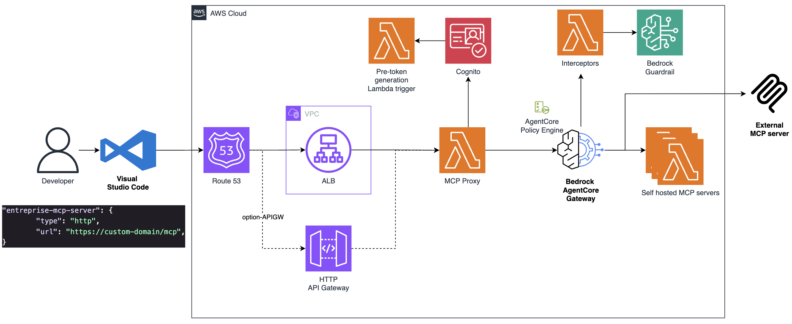

# Enterprise MCP Infrastructure

Enterprise-grade AWS infrastructure for Model Context Protocol (MCP) integration with Amazon Bedrock AgentCore, designed for secure IDE (VS Code) integration with OAuth 2.0 authentication and policy-based access control.



## Overview

This CDK infrastructure deploys a complete MCP gateway solution that enables VS Code and other IDEs to securely connect to Amazon Bedrock AgentCore through the Model Context Protocol. The solution provides enterprise features including:

- **OAuth 2.0 Authentication** via Amazon Cognito
- **Policy-Based Access Control** with custom Cedar policies
- **Request/Response Interception** for logging and transformation
- **PII Protection** using Bedrock Guardrails
- **Flexible Deployment Options** (ALB or API Gateway)
- **Custom Domain Support** with SSL/TLS

## Architecture

### Core Components

#### 1. **Authentication Layer**
- **Amazon Cognito User Pool**: Manages user authentication and OAuth 2.0 flows
- **Pre-Token Generation Lambda**: Injects custom claims (user tags) into JWT tokens for policy evaluation
- **OAuth Clients**:
  - VS Code Client (Authorization Code Grant with PKCE)

#### 2. **API Gateway Layer**
Choose between two deployment options:
- **Application Load Balancer (ALB)**: Production-grade with custom domains and SSL/TLS
- **API Gateway HTTP API**: Serverless, cost-effective for development/testing

#### 3. **MCP Proxy Lambda**
Central component that handles:
- OAuth metadata endpoints (`/.well-known/oauth-*`)
- Authorization flow (`/authorize`, `/callback`, `/token`)
- Dynamic Client Registration (`/register`)
- MCP protocol proxying to AgentCore Gateway
- Request/response rewriting for seamless integration

#### 4. **Amazon Bedrock AgentCore Gateway**
- MCP protocol handler with semantic search capabilities
- Supports multiple MCP versions (2025-03-26, 2025-06-18, 2025-11-25)
- Integrates with Lambda-based MCP servers
- Enforces authentication via Cognito
- Applies policy engine decisions

#### 5. **MCP Server Lambdas**
Example Lambda functions that implement MCP tools:
- **Weather Lambda**: Provides weather information tools (`get_weather`)
- **Inventory Lambda**: Provides inventory management tools (`get_inventory`)
- **User Details Lambda**: Provides user information tools (`get_user_email`, `get_user_cc_number`)

#### 6. **Interceptor Lambda**
- Intercepts requests and responses to/from the Gateway
- Enables logging, transformation, and custom business logic
- Receives request headers for context-aware processing

#### 7. **Policy Engine**
- Custom Cedar-based policy engine deployed via Lambda
- Evaluates user permissions based on JWT claims
- Example policies:
  - Admin users can access all tools (weather + inventory)
  - Regular users can only access weather tools

#### 8. **Bedrock Guardrails**
- Anonymizes PII in requests and responses
- Configured PII entity types:
  - **ADDRESS**: Anonymized in input and output
  - **NAME**: Anonymized in input and output
  - **EMAIL**: Anonymized in input and output
  - **CREDIT_DEBIT_CARD_NUMBER**: Blocked in input and output
- Applied via interceptor Lambda on `tools/call` method
- Enforces content policies with custom messaging

## Technology Stack

### Infrastructure
- **AWS CDK** 2.232.2+ (TypeScript)
- **Node.js** 24.x with TypeScript 5.9
- **AWS Bedrock AgentCore** (Alpha) 2.238.0-alpha.0+

### Runtime
- **Python** 3.12 (all Lambda functions)
- **Boto3** (AWS SDK for Python)

### AWS Services
| Service | Purpose |
|---------|---------|
| Amazon Cognito | OAuth 2.0 authentication and user management |
| AWS Lambda | Serverless compute for proxy, MCP servers, and policy engine |
| Amazon Bedrock AgentCore | MCP gateway and protocol handling |
| Application Load Balancer | Production routing with custom domains (optional) |
| API Gateway HTTP API | Serverless API endpoint (optional) |
| Amazon VPC | Network isolation for ALB deployment |
| AWS IAM | Identity and access management |
| Amazon Route53 | DNS management for custom domains |
| AWS Certificate Manager | SSL/TLS certificates |
| Bedrock Guardrails | Content filtering and PII protection |

## Prerequisites

1. **AWS Account** with appropriate permissions
2. **AWS CLI** configured with credentials
3. **Node.js** 18.x or later
4. **AWS CDK** CLI installed: `npm install -g aws-cdk`
5. **Python** 3.12 (for Lambda functions)

### For Custom Domain Setup (Optional)
- Route53 hosted zone
- ACM certificate in the same region
- Domain name available

## Deployment

### 1. Install Dependencies

```bash
cd enterprise-mcp-infra/cdk
npm install
```

### 2. Bootstrap CDK (First Time Only)

```bash
cdk bootstrap aws://ACCOUNT-ID/REGION
```

### 3. Configure Deployment Parameters

Edit `cdk/cdk.context.json` to configure your deployment:

#### Option A: ALB Deployment with Custom Domain

```json
{
  "deploymentType": "ALB",
  "domainName": "enterprise-mcp",
  "hostedZoneName": "example.com",
  "hostedZoneId": "Z1234567890ABC",
  "certificateArn": "arn:aws:acm:region:account:certificate/xxx"
}
```

#### Option B: API Gateway Deployment (Default URL)

```json
{
  "deploymentType": "API_GATEWAY",
  "domainName": "",
  "hostedZoneName": "",
  "hostedZoneId": "",
  "certificateArn": ""
}
```

#### Option C: API Gateway with Custom Domain

```json
{
  "deploymentType": "API_GATEWAY",
  "domainName": "enterprise-mcp.example.com",
  "hostedZoneName": "example.com",
  "hostedZoneId": "Z1234567890ABC",
  "certificateArn": "arn:aws:acm:region:account:certificate/xxx"
}
```

**Configuration Parameters:**

| Parameter | Description | Required | Default |
|-----------|-------------|----------|---------|
| `deploymentType` | Deployment type: `ALB` or `API_GATEWAY` | Yes | `ALB` |
| `domainName` | Custom domain name (e.g., `enterprise-mcp` for ALB, or full domain for API Gateway) | No (API Gateway only) | `""` |
| `hostedZoneName` | Route53 hosted zone name (e.g., `example.com`) | Only with custom domain | `""` |
| `hostedZoneId` | Route53 hosted zone ID (e.g., `Z1234567890ABC`) | Only with custom domain | `""` |
| `certificateArn` | ACM certificate ARN for HTTPS | Only with custom domain | `""` |

### 4. Deploy the Stack

```bash
cdk deploy
```

You can also override context values via command line:

```bash
cdk deploy -c deploymentType=API_GATEWAY
```

### 5. Save CDK Outputs

After deployment completes, the CDK will output important configuration values. **Copy the entire output** - you'll need it for the next step.

Example output:
```
EnterpriseMcpInfraStack.UserPoolId = us-east-1_XXXXXXXXX
EnterpriseMcpInfraStack.VSCodeClientId = xxxxxxxxxxxxxxxxxxxx
EnterpriseMcpInfraStack.EndpointUrl = https://enterprise-mcp.example.com
EnterpriseMcpInfraStack.VSCodeMcpConfig = {...}
EnterpriseMcpInfraStack.Gateway = agentcore-mcp-gateway-xxxxx
...
```

## Configuration

### Create Cognito Users

#### Using the Automated Script (Recommended)

1. **Edit** `enterprise-mcp-infra/scripts/script.py`:
   - Replace the `output` variable content with your actual CDK outputs (from step 4)
   - Customize the users list with your desired email addresses and passwords

2. **Run the script** to create users:
```bash
cd enterprise-mcp-infra/scripts
python script.py
```

The script will:
- Parse the CDK outputs to extract the User Pool ID
- Create two default users: `vscode-admin@example.com` and `vscode-user@example.com`
- Set permanent passwords (no need for password reset on first login)
- Skip users that already exist

**Default Users Created:**
- `vscode-admin@example.com` / `TempPassword123!`
- `vscode-user@example.com` / `TempPassword1234!`

#### Manual User Creation (Alternative)

If you prefer manual creation:

```bash
aws cognito-idp admin-create-user \
  --user-pool-id <UserPoolId> \
  --username admin@example.com \
  --user-attributes Name=email,Value=admin@example.com Name=email_verified,Value=true \
  --message-action SUPPRESS

aws cognito-idp admin-set-user-password \
  --user-pool-id <UserPoolId> \
  --username admin@example.com \
  --password 'YourSecurePassword123!' \
  --permanent
```

**Note**: The Pre-Token Generation Lambda automatically injects the `user_tag` claim into both ID tokens and access tokens based on the user's email address:
- `vscode-admin@example.com` receives `user_tag: "admin_user"`
- All other users receive `user_tag: "regular_user"`

This claim is used by the Policy Engine to enforce authorization rules for gateway tool access.

### VS Code Configuration

Create or update `.vscode/mcp.json` in your workspace:

```json
{
  "servers": {
    "enterprise-mcp-server": {
      "type": "http",
      "url": "https://enterprise-mcp.example.com/mcp",
      "headers": {
        "MCP-Protocol-Version": "2025-11-25"
      }
    }
  }
}
```

## Usage

### 1. Start VS Code
The MCP extension will automatically detect the configuration and prompt for authentication.

### 2. Authenticate
- Click "Sign In" when prompted
- Enter your Cognito credentials
- Complete the OAuth flow

### 3. Use MCP Tools
Once authenticated, you can use the MCP tools through VS Code Copilot or the MCP extension:
- Weather information: Ask about current weather (all authenticated users)
- Inventory queries: Check product inventory (admin users only)
- User details: Retrieve user email and credit card information (all authenticated users with user_tag)

## Policy Management

### Understanding the Policy Engine

The policy engine uses Cedar policies to control access to MCP tools based on user attributes injected into JWT tokens.

**Example Policies** (deployed by default):

```cedar
// Admin users can access inventory and weather tools
permit (
  principal is AgentCore::OAuthUser,
  action in [AgentCore::Action::"inventory-tool", AgentCore::Action::"weather-tool"],
  resource == AgentCore::Gateway::"<gateway-arn>"
) when {
  principal.hasTag("user_tag") &&
  principal.getTag("user_tag") == "admin_user"
};

// Regular users can only access weather tool
permit (
  principal is AgentCore::OAuthUser,
  action in [AgentCore::Action::"weather-tool"],
  resource == AgentCore::Gateway::"<gateway-arn>"
) when {
  principal.hasTag("user_tag") &&
  principal.getTag("user_tag") == "regular_user"
};

// All users with user_tag can access user details tool
permit (
  principal is AgentCore::OAuthUser,
  action in [AgentCore::Action::"user-details-tool"],
  resource == AgentCore::Gateway::"<gateway-arn>"
) when {
  principal.hasTag("user_tag")
};
```

### Customizing Policies

The stack deploys three Cedar policies by default. To customize, edit the policy statements in `cdk/lib/enterprise-mcp-infra-stack.ts`:

```typescript
// Example: Modify admin user policy
const policyEngineStatementInventoryTool = `
  permit (
    principal is AgentCore::OAuthUser,
    action in [AgentCore::Action::"inventory-tool", AgentCore::Action::"weather-tool", AgentCore::Action::"user-details-tool"],
    resource == AgentCore::Gateway::"${gateway.gatewayArn}"
  ) when {
    principal.hasTag("user_tag") &&
    principal.getTag("user_tag") == "admin_user"
  };
`;

// Example: Add a new policy for a specific tool
const customPolicy = `
  permit (
    principal is AgentCore::OAuthUser,
    action in [AgentCore::Action::"user-details-tool"],
    resource == AgentCore::Gateway::"${gateway.gatewayArn}"
  ) when {
    principal.hasTag("department") &&
    principal.getTag("department") == "finance"
  };
`;

// Add the custom policy
agentCorePolicyEngine.addPolicy(
  "finance_user_details_policy",
  "Policy for finance users to access user details",
  customPolicy
);
```

Then redeploy:

```bash
cdk deploy
```

**Important**: Policy tag names must match the claim names injected by the Pre-Token Generation Lambda (e.g., `user_tag` not `custom:user_tag`).

## Monitoring and Debugging

### Lambda Logs

```bash
# MCP Proxy Lambda
aws logs tail /aws/lambda/<ProxyLambdaName> --follow

# Policy Engine Lambda
aws logs tail /aws/lambda/<PolicyEngineLambdaName> --follow

# Interceptor Lambda
aws logs tail /aws/lambda/<InterceptorLambdaName> --follow
```

### CloudWatch Insights Queries

**OAuth Flow Tracking:**
```
fields @timestamp, @message
| filter @message like /HANDLE_AUTHORIZE|HANDLE_CALLBACK/
| sort @timestamp desc
```

**Gateway Requests:**
```
fields @timestamp, method, path, statusCode
| filter @message like /proxy_to_gateway/
| sort @timestamp desc
```

## Security Considerations

### Authentication
- OAuth 2.0 with PKCE (Proof Key for Code Exchange)
- JWT tokens with custom claims
- Secure token storage in VS Code

### Authorization
- Policy-based access control using Cedar
- User attribute injection via Lambda triggers
- Gateway-level authorization enforcement

### Data Protection
- SSL/TLS encryption in transit
- PII anonymization via Bedrock Guardrails
- VPC isolation for ALB deployments

### Secrets Management
- Client secrets stored in environment variables
- OAuth tokens never exposed to logs
- IAM role-based access for Lambda functions

## Troubleshooting

### Issue: "Failed to authenticate"
**Solution**: Check Cognito user credentials and ensure the user has the correct custom attributes.

### Issue: "Tool not available"
**Solution**: Verify the user's `custom:user_tag` attribute matches the policy requirements.

### Issue: "Gateway timeout"
**Solution**: Check Lambda timeout settings (default: 300 seconds) and Gateway connectivity.

### Issue: "Invalid redirect_uri"
**Solution**: Ensure callback URLs are properly registered in the Cognito client configuration.

### Issue: ALB health check failing
**Solution**: The `/ping` endpoint should return 200. Check Lambda logs for errors.

## Cleanup

To remove all resources:

```bash
cdk destroy
```

**Warning**: This will delete all resources including Cognito users, Lambda functions, and configurations.

## Architecture Decisions

### Why Two Deployment Options?

- **ALB**: Production environments requiring custom domains, SSL/TLS, and fine-grained routing
- **API Gateway**: Development/testing, serverless preference, cost optimization

### Why Lambda for MCP Servers?

- Serverless, auto-scaling
- Pay-per-use pricing
- Easy integration with AgentCore Gateway
- No infrastructure management

### Why Custom Policy Engine?

- Flexible, attribute-based access control
- Cedar policy language for complex authorization logic
- Runtime policy evaluation without redeployment
- Integration with JWT custom claims

## Extending the Solution

### Adding New MCP Tools

1. Create a new Lambda function in `cdk/lambda/mcp-servers/`
2. Define the tool schema
3. Add the Lambda target to the Gateway in `enterprise-mcp-infra-stack.ts`
4. Update policies if needed

### Custom Interceptors

Modify `cdk/lambda/interceptor/interceptor.py` to add custom logic:
- Request validation
- Response transformation
- Logging and metrics
- Integration with external systems

### External MCP Servers

Configure the Gateway to connect to external MCP servers via HTTP/HTTPS with credential providers.

## References

- [AWS CDK Documentation](https://docs.aws.amazon.com/cdk/)
- [Amazon Bedrock AgentCore](https://docs.aws.amazon.com/bedrock/)
- [Model Context Protocol Specification](https://modelcontextprotocol.io/)
- [OAuth 2.0 RFC 6749](https://tools.ietf.org/html/rfc6749)
- [Cedar Policy Language](https://www.cedarpolicy.com/)

## License

This project is provided as-is for demonstration purposes.

## Support

For issues and questions:
1. Check CloudWatch Logs for Lambda functions
2. Review CloudFormation stack events
3. Verify IAM permissions
4. Consult AWS Bedrock AgentCore documentation
