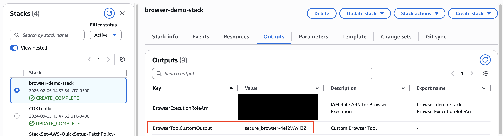

# AgentCore Browser Tool with AWS Network Firewall

This example demonstrates how to deploy Amazon Bedrock AgentCore Browser Tool with domain-based allow/deny listing using AWS Network Firewall. This provides a secure, controlled browsing environment with network-level filtering.

## Architecture Overview

The solution deploys:
- **VPC with 3 subnets**: Private (Browser), Public (NAT Gateway), and Firewall
- **AWS Network Firewall**: Domain filtering with allow/deny lists
- **AgentCore Browser**: Deployed in private subnet with VPC configuration
- **NAT Gateway**: Outbound internet access through firewall inspection
- **CloudWatch Logs**: Firewall alert and flow logs for monitoring

## Quick Deploy

To create the stack using CloudFormation, use following script:

[](agentcore-browser-firewall.yaml)

### Parameters

- **VpcCidr**: CIDR block for the VPC (default: `10.0.0.0/16`)
- **AvailabilityZone**: Select an AZ for all subnets
- **AllowedDomains**: Comma-separated list of allowed domains (e.g., `.example.com,.wikipedia.org`)
- **DeniedDomains**: Comma-separated list of denied domains (e.g., `.facebook.com,.twitter.com`)
- **BrowserName**: Name for the browser (default: `secure_browser`)
- **BucketConfigForOutput**: S3 bucket name for browser recordings

## Testing

### Option 1 - Jupyter Notebook

If you wanna a straitghforward step-by-step, you can open [verify_domain_filtering.ipynb](verify_domain_filtering.ipynb) and run the step by step.


### Option 2 - Python Code

If you wanna go direct trough the code, you can go with Python files and code. 

After deployment, get the AgentCore Browser identifier. You can get it from command line:

```bash
# Get the Browser ID from CloudFormation outputs
export BROWSER_ID=$(aws cloudformation describe-stacks \
  --stack-name agentcore-browser-firewall \
  --query 'Stacks[0].Outputs[?OutputKey==`BrowserToolCustomOutput`].OutputValue' \
  --output text)
```

or from AWS Console, from output information on Cloud Formation stack:



**Important: `verify_domain_filtering.py` script expect the browser identified into BROWSER_ID env variable.**

Test the domain filtering using the provided Python script:

```bash
# Install dependencies
pip install -r requirements.txt
playwright install chromium

# Run tests
python verify_domain_filtering.py
```

### Test Script

The `verify_domain_filtering.py` script validates:
- ✅ Allowed domains (example.com, wikipedia.org) - should succeed
- ❌ Denied domains (facebook.com, twitter.com) - should be blocked
- ❌ Unlisted domains - should be blocked (default deny)

## Files

- **agentcore-browser-firewall.yaml**: CloudFormation template with complete infrastructure
- **verify_domain_filtering.py**: Automated test script using Playwright to verify firewall rules
- **verify_domain_filtering.ipynb**: Jupyter notebook with step-by-step

## Monitoring

View firewall logs in CloudWatch:
- Alert logs: `/aws/network-firewall/{StackName}/alerts`
- Flow logs: `/aws/network-firewall/{StackName}/flow`

## Cleanup

```bash
aws cloudformation delete-stack --stack-name agentcore-browser-firewall
```

## Security Considerations

- Browser runs in private subnet with no direct internet access
- All traffic inspected by Network Firewall before reaching internet
- Default deny policy - only explicitly allowed domains are accessible
- Recordings stored in S3 with appropriate IAM permissions

