# Architecture: Bedrock AgentCore Template

## Architecture Overview

This template uses Amazon Bedrock AgentCore for deploying production-ready AI agents with persistent memory and RAG capabilities.

```mermaid
graph TB
    %% User Interface Layer
    User[👤 User] --> WebUI[🌐 Web Interface<br/>Next.js]
    
    %% Content Delivery Network
    WebUI --> CloudFront[☁️ CloudFront CDN]
    
    %% CloudFront Routes
    CloudFront -->|Static Files| S3Web[📦 S3 Bucket<br/>Web Assets]
    CloudFront -->|API Calls| API[🔌 API Gateway]
    
    %% API Layer
    API --> Auth[🔐 Cognito]
    API --> Lambda[⚡ Lambda]
    
    %% AgentCore Layer
    Lambda --> AgentCoreRuntime[🤖 AgentCore Runtime<br/>Strands Agent]
    AgentCoreRuntime --> AgentCoreMemory[🧠 AgentCore Memory<br/>STM + LTM]
    AgentCoreRuntime --> Bedrock[🔮 Bedrock<br/>Claude Sonnet 4]
    
    %% Data Storage Layer
    AgentCoreRuntime --> OpenSearch[🔍 OpenSearch<br/>Vectors]
    OpenSearch --> S3Docs[📄 S3 Bucket<br/>Documents]
    
    %% Styling
    classDef userLayer fill:#e1f5fe
    classDef cdnLayer fill:#f3e5f5
    classDef apiLayer fill:#e8f5e8
    classDef agentLayer fill:#fff3e0
    classDef dataLayer fill:#fce4ec
    
    class User userLayer
    class WebUI,CloudFront cdnLayer
    class S3Web,API,Auth,Lambda apiLayer
    class AgentCoreRuntime,AgentCoreMemory,Bedrock agentLayer
    class OpenSearch,S3Docs dataLayer
```



## AgentCore Architecture

Amazon Bedrock AgentCore provides a managed infrastructure for deploying AI agents:

```
┌─────────────────────────────────────────────────────────────────┐
│                        Web Console                               │
│                    (CloudFront + S3)                            │
└─────────────────────────────────────────────────────────────────┘
                              │
                              ▼
┌─────────────────────────────────────────────────────────────────┐
│                      API Gateway                                 │
│                   (REST API + Cognito)                          │
└─────────────────────────────────────────────────────────────────┘
                              │
                              ▼
┌─────────────────────────────────────────────────────────────────┐
│                   AgentCore Runtime                              │
│              (Containerized Strands Agent)                       │
│  ┌─────────────────────────────────────────────────────────┐   │
│  │  • Claude Sonnet 4 (via Bedrock)                        │   │
│  │  • RAG via OpenSearch Serverless                        │   │
│  │  • Session isolation per user                           │   │
│  │  • Automatic scaling and lifecycle management           │   │
│  └─────────────────────────────────────────────────────────┘   │
└─────────────────────────────────────────────────────────────────┘
                              │
              ┌───────────────┼───────────────┐
              ▼               ▼               ▼
┌─────────────────┐ ┌─────────────────┐ ┌─────────────────┐
│ AgentCore Memory│ │    OpenSearch   │ │   S3 Documents  │
│  (STM + LTM)    │ │   Serverless    │ │  (Knowledge)    │
│                 │ │                 │ │                 │
│ • Semantic      │ │ • Vector search │ │ • PDF, TXT, MD  │
│ • User Prefs    │ │ • k-NN queries  │ │ • DOCX, HTML    │
│ • Summarization │ │ • Embeddings    │ │ • Auto-indexed  │
└─────────────────┘ └─────────────────┘ └─────────────────┘
```

## Component Descriptions

### User Interface Layer
- **Web Interface**: Modern React-based chat interface built with Next.js
- **CloudFront CDN**: Global content delivery with HTTPS, caching, and DDoS protection
- **S3 Static Hosting**: Scalable storage for web application assets

### API Layer
- **API Gateway**: Managed REST API with security and throttling
- **Cognito Authentication**: Secure user management with JWT tokens
- **Lambda Function**: Serverless compute that invokes AgentCore Runtime

### AgentCore Layer
- **AgentCore Runtime**: Containerized agent deployment with:
  - Automatic scaling based on demand
  - Session isolation per user
  - Lifecycle management (idle timeout, max lifetime)
  - Cognito authentication integration
- **AgentCore Memory**: Persistent memory with:
  - Short-term memory (STM) for conversation context
  - Long-term memory (LTM) with extraction strategies
  - Semantic, user preference, and summarization strategies
- **Bedrock Foundation Model**: Claude Sonnet 4 for natural language processing

### Data Storage Layer
- **OpenSearch Serverless**: Vector database for semantic search
- **S3 Document Storage**: Knowledge base document storage

## Authentication Flow

### 🔓 Public Access (No Authentication Required)
- Static web assets (HTML, JavaScript, CSS)
- Login page and application shell

### 🔒 Protected Access (Cognito JWT Required)
- Chat API endpoints (`/api/chat/*`)
- AgentCore Runtime invocation
- Session and conversation history

### Authentication Sequence
1. User accesses CloudFront URL → Receives static web application
2. User enters credentials → Cognito validates and returns JWT token
3. JavaScript stores JWT token securely in browser
4. API requests include JWT token in Authorization header
5. API Gateway validates JWT with Cognito
6. Lambda invokes AgentCore Runtime with user context

## AgentCore Memory Architecture

AgentCore Memory provides both short-term and long-term memory capabilities:

```
┌─────────────────────────────────────────────────────────────────┐
│                    AgentCore Memory                              │
├─────────────────────────────────────────────────────────────────┤
│                                                                  │
│  ┌─────────────────────────────────────────────────────────┐   │
│  │              Short-Term Memory (STM)                     │   │
│  │  • Conversation history within session                   │   │
│  │  • 90-day expiration (configurable)                     │   │
│  │  • Immediate storage via CreateEvent API                │   │
│  └─────────────────────────────────────────────────────────┘   │
│                              │                                   │
│                              ▼                                   │
│  ┌─────────────────────────────────────────────────────────┐   │
│  │              Long-Term Memory (LTM)                      │   │
│  │  Extraction Strategies:                                  │   │
│  │  • Semantic: Facts and concepts                         │   │
│  │  • User Preference: Personalization data                │   │
│  │  • Summarization: Conversation compression              │   │
│  │  • Episodic: Meaningful interaction slices              │   │
│  └─────────────────────────────────────────────────────────┘   │
│                                                                  │
└─────────────────────────────────────────────────────────────────┘
```

## Data Flow

1. **User Access**: User navigates to CloudFront URL
2. **Authentication**: User authenticates with Cognito
3. **Chat Request**: User sends message through web interface
4. **API Call**: Request routed through CloudFront → API Gateway
5. **Token Validation**: API Gateway validates JWT with Cognito
6. **Runtime Invocation**: Lambda invokes AgentCore Runtime
7. **Memory Retrieval**: Agent retrieves conversation history and relevant memories
8. **Knowledge Search**: Agent searches OpenSearch for relevant documents
9. **Response Generation**: Claude Sonnet 4 generates response with context
10. **Memory Storage**: Interaction stored in AgentCore Memory
11. **Return Response**: Response flows back to user

## AWS Service Mapping

| Component | AWS Service | Purpose |
|-----------|-------------|---------|
| Web Interface | S3 + CloudFront | Static website hosting and global CDN |
| Authentication | Amazon Cognito | User management and JWT authentication |
| API Management | API Gateway | RESTful API with security and throttling |
| Compute | AWS Lambda | Serverless invocation of AgentCore Runtime |
| Agent Runtime | AgentCore Runtime | Containerized agent deployment |
| Agent Memory | AgentCore Memory | Short-term and long-term memory |
| AI Model | Amazon Bedrock | Claude Sonnet 4 foundation model |
| Vector Database | OpenSearch Serverless | Semantic search and embeddings |
| Document Storage | Amazon S3 | Knowledge base document storage |

## Security Features

### Authentication & Authorization
- **Cognito User Pool**: Secure user authentication with password policies
- **JWT Tokens**: Industry-standard tokens for API authentication
- **AgentCore Cognito Integration**: Runtime authenticates users via Cognito
- **Session Isolation**: Each user has isolated agent sessions

### Data Protection
- **Encryption at Rest**: All data encrypted in S3, OpenSearch, Memory
- **Encryption in Transit**: HTTPS/TLS 1.2+ enforced
- **KMS Integration**: Customer-managed keys for Memory encryption
- **CloudFront OAC**: Modern Origin Access Control for S3

### Access Control
- **IAM Least Privilege**: All roles scoped to minimum permissions
- **Service-to-Service Auth**: AWS services authenticate using IAM roles
- **No Hardcoded Credentials**: All secrets managed by AWS services

## Cost Considerations

### Estimated Monthly Costs

| Service | Low Usage | Medium Usage | High Usage |
|---------|-----------|--------------|------------|
| AgentCore Runtime | $20-50 | $80-150 | $200-400 |
| AgentCore Memory | $5-15 | $20-40 | $50-100 |
| Bedrock (Claude) | $10-30 | $50-100 | $150-300 |
| OpenSearch Serverless | $50-100 | $150-300 | $400-600 |
| Lambda | $1-5 | $10-20 | $30-50 |
| API Gateway | $1-10 | $15-30 | $40-80 |
| CloudFront | $5-15 | $15-30 | $30-60 |
| S3 Storage | $1-5 | $5-15 | $15-30 |
| Cognito | $0-5 | $5-10 | $10-20 |
| **Total** | **$93-235** | **$350-695** | **$925-1,640** |

*Costs vary based on usage patterns, data volume, and geographic distribution.*

## Scalability Features

- **Serverless Architecture**: Automatically scales based on demand
- **AgentCore Auto-Scaling**: Runtime scales sessions automatically
- **Global Distribution**: CloudFront ensures fast access worldwide
- **Managed Services**: All components are fully managed AWS services

---

*This architecture provides a production-ready foundation for conversational AI applications using Amazon Bedrock AgentCore.*
